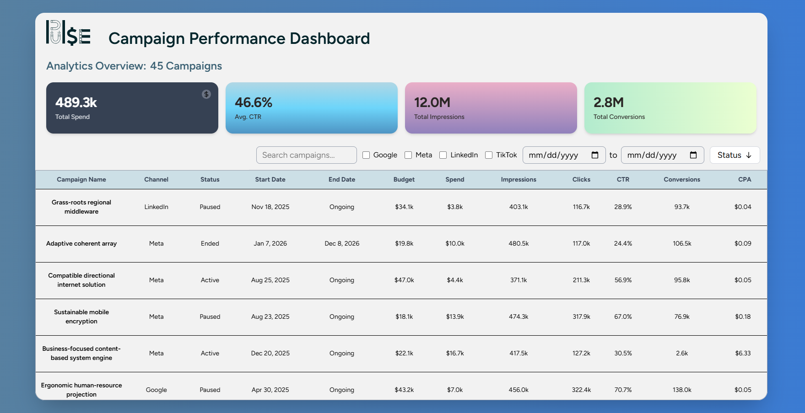
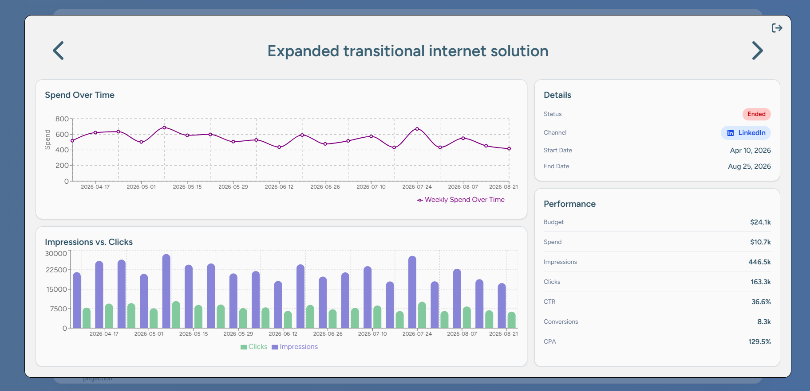

# Pulse — Campaign Performance Dashboard

Pulse is a frontend analytics dashboard for ad campaign data, built for the kind of reporting workflows 
that digital agencies and marketing teams deal with every day.

## Preview

## Features

- Campaign KPI summary cards
- Search, channel, status, and date range filtering
- Multi-column sorting with visible sort priority indicators
- Computed metrics for CTR and CPA
- URL-synced filters and sorting for shareable dashboard views
- Responsive data table with horizontal scrolling on smaller screens
- Campaign detail modal with previous / next navigation
- Generated weekly campaign metrics for realistic chart data
- Weekly spend chart
- Impressions vs. clicks chart

## Tech Stack

- React
- TypeScript
- Vite
- Tailwind CSS
- Zustand
- Recharts
- Radix UI Dialog
- Vitest
- jsdom

## Key Concepts & Decisions

### 1. URL-Synced Dashboard State

Filters and sorting are synced with the browser URL so dashboard views can be bookmarked or shared.

Example:

?search=nike&channels=Google,Meta&sort=spend:asc,ctr:desc

The app follows a two-phase flow:

initial page load: URL → Zustand
later state changes: Zustand → URL

This keeps the UI state predictable while avoiding unnecessary URL writes on first render.

### 2. Filter Pipeline

Filtering is handled through pure utility functions:

search
channel
status
date range

The campaign list flows through the same predictable pipeline every time:

campaigns → search → channel → status → date range → result

Keeping this logic outside the UI makes it easier to test, debug, and extend.

### 3. Multi-Sort Table Logic

The table supports layered sorting with tie-breakers.

Example:

Spend ascending → CTR descending → CPA ascending

Each active sort displays a priority badge, making it clear which sort layer is applied first.

Computed fields like CTR and CPA are supported even though they are not stored directly on each campaign object.

### 4. Generated Weekly Metrics

The original campaign data only contained total spend, impressions, clicks, and conversions.

To support meaningful charts, I added generated weekly metrics:

type WeeklyMetrics = {
  weekStart: string;
  spend: number;
  impressions: number;
  clicks: number;
};

A local Node script distributes campaign totals across weekly buckets with controlled variation, so charts avoid flat placeholder data while still preserving the original campaign totals.

### 5. Responsive Dashboard Layout

The dashboard uses a responsive layout that keeps the main app shell stable while allowing dense table data to scroll horizontally on smaller screens. This prevents table columns from becoming unreadably compressed while preserving the overall page spacing and layout.

### 6. Accessibility

The dashboard includes accessibility considerations such as:

- semantic table structure
- keyboard-accessible sorting controls
- ARIA sorting attributes
- accessible modal dialog behavior using Radix UI
- keyboard navigation for interactive rows and controls

## Testing

Vitest is used to test core utility logic, including:

- sort encoding / decoding
- URL filter updates
- URL sort updates
- preserving existing query parameters
- clearing inactive filters from the URL
- Running Locally

## Install dependencies:

npm install

Start the development server:

npm run dev

Run tests:

npm run test

## Future Improvements:

- Additional campaign comparison charts
- Saved dashboard views
- API integration
- Expanded test coverage
- Improved mobile filter UX
- Campaign selection and bulk actions

